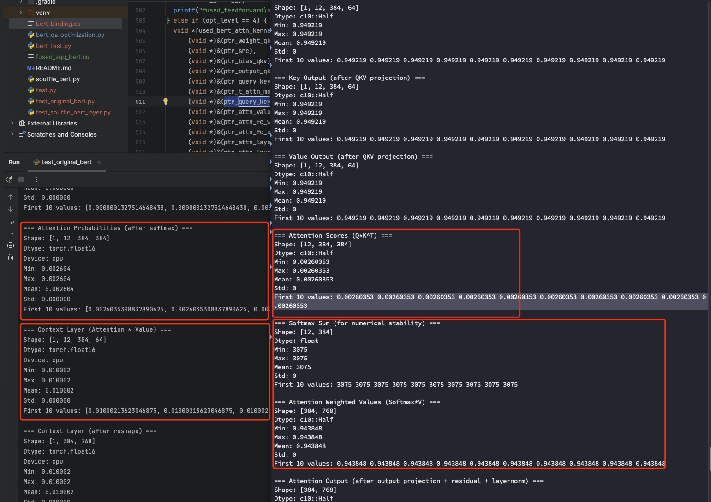

# Bert-Demo

## Reproduce steps
1. enter container `souffle-tvm-0.8:latest`
2. cd /workspace/souffle-models/python/models/bert
3. copy, paste test_souffle_bert_layer.py
4. python test_souffle_bert_layer.py

## Sample output

- 输入矩阵值设置为: 0.125 
- QKV 矩阵值设置为: 0.01
- 其他权重矩阵使用 bert-base-uncased 的 layers[5] (第六层) 的权重

结果：原始模型 Q*K^T + softmax 后的结果和 Souffle 的 Q*K^T 结果相同，但是 Attention * V 结果不对。


### souffle_bert_layer 输出
```shell
root@ca023b78bfb0:/workspace/souffle-models/python/models/bert# python test_souffle_bert_layer.py
Loading model: bert-base-uncased
/workspace/anaconda3/lib/python3.9/site-packages/huggingface_hub/file_download.py:945: FutureWarning: `resume_download` is deprecated and will be removed in version 1.0.0. Downloads always resume when possible. If you want to force a new download, use `force_download=True`.
  warnings.warn(

--- 调试模式: 替换 Input Embeddings 为常数矩阵 (0.125) ---

--- Running Original Model Layer 5 ---

--- Testing Config 8 ---
=== Input src ===
Shape: [1, 384, 768]
Dtype: c10::Half
Min: 0.125
Max: 0.125
Mean: 0.125
Std: 0
First 10 values: 0.125 0.125 0.125 0.125 0.125 0.125 0.125 0.125 0.125 0.125

=== QKV Weight ===
Shape: [3, 768, 768]
Dtype: c10::Half
Min: 0.0100021
Max: 0.0100021
Mean: 0.0100021
Std: 0
First 10 values: 0.0100021 0.0100021 0.0100021 0.0100021 0.0100021 0.0100021 0.0100021 0.0100021 0.0100021 0.0100021

=== Attention FC Weight ===
Shape: [768, 768]
Dtype: c10::Half
Min: -0.297607
Max: 0.321533
Mean: 1.61715e-05
Std: 0.0331522
First 10 values: -0.0073967 0.0243988 -0.0380249 0.0138092 -0.00263023 0.0094223 0.029541 0.0057106 0.0140305 0.0150452

=== Feed Forward FC1 Weight ===
Shape: [768, 3072]
Dtype: c10::Half
Min: -0.354004
Max: 0.551758
Mean: 4.66633e-05
Std: 0.0405463
First 10 values: -0.0324707 0.0725098 -0.0820312 0.00772476 0.0253296 0.0421448 -0.00195885 -0.0562744 -0.060791 -0.0361328

=== Feed Forward FC2 Weight ===
Shape: [3072, 768]
Dtype: c10::Half
Min: -6.02344
Max: 2.49805
Mean: 5.81785e-06
Std: 0.0392935
First 10 values: 0.064209 -0.017395 -0.0509644 0.00523758 0.0442505 -0.00543976 0.0298462 0.0110931 -0.00862885 0.00624084

fused_attn kernel launched

========== After Attention Kernel ==========
=== Raw QKV Output (fused QKV projections) ===
Shape: [3, 12, 384, 64]
Dtype: c10::Half
Min: 0.949219
Max: 0.949219
Mean: 0.949219
Std: 0
First 10 values: 0.949219 0.949219 0.949219 0.949219 0.949219 0.949219 0.949219 0.949219 0.949219 0.949219

=== Query Output (after QKV projection) ===
Shape: [1, 12, 384, 64]
Dtype: c10::Half
Min: 0.949219
Max: 0.949219
Mean: 0.949219
Std: 0
First 10 values: 0.949219 0.949219 0.949219 0.949219 0.949219 0.949219 0.949219 0.949219 0.949219 0.949219

=== Key Output (after QKV projection) ===
Shape: [1, 12, 384, 64]
Dtype: c10::Half
Min: 0.949219
Max: 0.949219
Mean: 0.949219
Std: 0
First 10 values: 0.949219 0.949219 0.949219 0.949219 0.949219 0.949219 0.949219 0.949219 0.949219 0.949219

=== Value Output (after QKV projection) ===
Shape: [1, 12, 384, 64]
Dtype: c10::Half
Min: 0.949219
Max: 0.949219
Mean: 0.949219
Std: 0
First 10 values: 0.949219 0.949219 0.949219 0.949219 0.949219 0.949219 0.949219 0.949219 0.949219 0.949219

=== Attention Scores (Q*K^T) ===
Shape: [12, 384, 384]
Dtype: c10::Half
Min: 0.00260353
Max: 0.00260353
Mean: 0.00260353
Std: 0
First 10 values: 0.00260353 0.00260353 0.00260353 0.00260353 0.00260353 0.00260353 0.00260353 0.00260353 0.00260353 0.00260353

=== Softmax Sum (for numerical stability) ===
Shape: [12, 384]
Dtype: float
Min: 3075
Max: 3075
Mean: 3075
Std: 0
First 10 values: 3075 3075 3075 3075 3075 3075 3075 3075 3075 3075

=== Attention Weighted Values (Softmax*V) ===
Shape: [384, 768]
Dtype: c10::Half
Min: 0.943848
Max: 0.943848
Mean: 0.943848
Std: 0
First 10 values: 0.943848 0.943848 0.943848 0.943848 0.943848 0.943848 0.943848 0.943848 0.943848 0.943848

=== Attention Output (after output projection + residual + layernorm) ===
Shape: [384, 768]
Dtype: c10::Half
Min: -3.42578
Max: 3.53516
Mean: -8.75245e-05
Std: 1.00029
First 10 values: -0.545898 -1.02148 0.400635 0.42334 0.199585 0.0528564 -0.0377502 -0.922852 1.76074 0.00917053

=== Attention LayerNorm Sum ===
Shape: [384]
Dtype: float
Min: 104.983
Max: 104.983
Mean: 104.983
Std: 0
First 10 values: 104.983 104.983 104.983 104.983 104.983 104.983 104.983 104.983 104.983 104.983

=== Attention LayerNorm Variance ===
Shape: [384]
Dtype: float
Min: 53.7225
Max: 53.7225
Mean: 53.7225
Std: 3.45769e-06
First 10 values: 53.7225 53.7225 53.7225 53.7225 53.7225 53.7225 53.7225 53.7225 53.7225 53.7225

fused_attn
fused_feedforward kernel launched

========== After Feed Forward Kernel ==========
=== Feed Forward FC1 Output (intermediate layer) ===
Shape: [384, 3072]
Dtype: c10::Half
Min: 0
Max: 4.44531
Mean: 0.44444
Std: 0.669651
First 10 values: 1.59863 0 1.69727 0 0.0299835 1.07812 0 0 0.72998 0

=== Feed Forward FC2 Output (final output after residual + layernorm) ===
Shape: [384, 768]
Dtype: c10::Half
Min: -3.47461
Max: 3.86914
Mean: 6.54074e-05
Std: 0.999856
First 10 values: -0.429932 -1.37988 0.485352 0.894043 0.81543 0.275146 0.0900879 -0.49585 0.325195 0.76709

=== Feed Forward LayerNorm Sum ===
Shape: [384]
Dtype: float
Min: -14.4642
Max: -14.4642
Mean: -14.4642
Std: 0
First 10 values: -14.4642 -14.4642 -14.4642 -14.4642 -14.4642 -14.4642 -14.4642 -14.4642 -14.4642 -14.4642

=== Feed Forward LayerNorm Variance ===
Shape: [384]
Dtype: float
Min: 2221.78
Max: 2221.78
Mean: 2221.78
Std: 0.000125579
First 10 values: 2221.78 2221.78 2221.78 2221.78 2221.78 2221.78 2221.78 2221.78 2221.78 2221.78
```

### hugging face bert layer 输出
```shell
Loading model: bert-base-uncased

--- 调试模式: 替换 Input Embeddings 为常数矩阵 (0.125) ---
=== Input Embeddings ===
Shape: [1, 384, 768]
Dtype: torch.float16
Device: cpu
Min: 0.125000
Max: 0.125000
Mean: 0.125000
Std: 0.000000
First 10 values: [0.125, 0.125, 0.125, 0.125, 0.125, 0.125, 0.125, 0.125, 0.125, 0.125]

正在将参数 attention.self.query.bias 的值设置为 0。
正在将参数 attention.self.key.bias 的值设置为 0。
正在将参数 attention.self.value.bias 的值设置为 0。
正在将参数 attention.output.dense.bias 的值设置为 0。
正在将参数 attention.output.LayerNorm.bias 的值设置为 0。
正在将参数 intermediate.dense.bias 的值设置为 0。
正在将参数 output.dense.bias 的值设置为 0。
正在将参数 output.LayerNorm.bias 的值设置为 0。

修改后的 attention.self.query.bias 矩阵:
tensor([0., 0., 0., 0., 0., 0., 0., 0., 0., 0., 0., 0., 0., 0., 0., 0., 0., 0., 0., 0., 0., 0., 0., 0.,
        ...
        0., 0., 0., 0., 0., 0., 0., 0., 0., 0., 0., 0., 0., 0., 0., 0., 0., 0., 0., 0., 0., 0., 0., 0.],
       dtype=torch.float16)

--- Running Debug BERT Layer ---

============================================================
BERT LAYER FORWARD PASS START
============================================================

========== Self-Attention Forward Pass ==========
=== Input Hidden States ===
Shape: [1, 384, 768]
Dtype: torch.float16
Device: cpu
Min: 0.125000
Max: 0.125000
Mean: 0.125000
Std: 0.000000
First 10 values: [0.125, 0.125, 0.125, 0.125, 0.125, 0.125, 0.125, 0.125, 0.125, 0.125]

=== Query Linear Output (before reshape) ===
Shape: [1, 384, 768]
Dtype: torch.float16
Device: cpu
Min: -0.983887
Max: 0.975586
Mean: -0.002582
Std: 0.218265
First 10 values: [-0.0196075439453125, 0.002475738525390625, 0.00739288330078125, 0.0031719207763671875, -0.0511474609375, -0.042938232421875, -0.08795166015625, -0.1409912109375, -0.055084228515625, -0.0058135986328125]

=== Key Linear Output (before reshape) ===
Shape: [1, 384, 768]
Dtype: torch.float16
Device: cpu
Min: -0.772949
Max: 0.568359
Mean: -0.005667
Std: 0.132818
First 10 values: [-0.03619384765625, -0.02471923828125, -0.004486083984375, 0.1092529296875, 0.03192138671875, -0.044677734375, -0.09307861328125, -0.0190582275390625, -0.0755615234375, 0.06842041015625]

=== Value Linear Output (before reshape) ===
Shape: [1, 384, 768]
Dtype: torch.float16
Device: cpu
Min: -0.580566
Max: 0.565430
Mean: -0.003667
Std: 0.163796
First 10 values: [-0.2139892578125, 0.2225341796875, -0.05279541015625, 0.076904296875, -0.2353515625, 0.024200439453125, -0.0256805419921875, -0.060882568359375, -0.1163330078125, 0.06549072265625]

=== Query Layer (after multi-head reshape) ===
Shape: [1, 12, 384, 64]
Dtype: torch.float16
Device: cpu
Min: 0.010002
Max: 0.010002
Mean: 0.010002
Std: 0.000000
First 10 values: [0.01000213623046875, 0.01000213623046875, 0.01000213623046875, 0.01000213623046875, 0.01000213623046875, 0.01000213623046875, 0.01000213623046875, 0.01000213623046875, 0.01000213623046875, 0.01000213623046875]

=== Key Layer (after multi-head reshape) ===
Shape: [1, 12, 384, 64]
Dtype: torch.float16
Device: cpu
Min: 0.010002
Max: 0.010002
Mean: 0.010002
Std: 0.000000
First 10 values: [0.01000213623046875, 0.01000213623046875, 0.01000213623046875, 0.01000213623046875, 0.01000213623046875, 0.01000213623046875, 0.01000213623046875, 0.01000213623046875, 0.01000213623046875, 0.01000213623046875]

=== Value Layer (after multi-head reshape) ===
Shape: [1, 12, 384, 64]
Dtype: torch.float16
Device: cpu
Min: 0.010002
Max: 0.010002
Mean: 0.010002
Std: 0.000000
First 10 values: [0.01000213623046875, 0.01000213623046875, 0.01000213623046875, 0.01000213623046875, 0.01000213623046875, 0.01000213623046875, 0.01000213623046875, 0.01000213623046875, 0.01000213623046875, 0.01000213623046875]

=== key_layer.transpose(-1, -2) ===
Shape: [1, 12, 64, 384]
Dtype: torch.float16
Device: cpu
Min: 0.010002
Max: 0.010002
Mean: 0.010002
Std: 0.000000
First 10 values: [0.01000213623046875, 0.01000213623046875, 0.01000213623046875, 0.01000213623046875, 0.01000213623046875, 0.01000213623046875, 0.01000213623046875, 0.01000213623046875, 0.01000213623046875, 0.01000213623046875]

=== torch.matmul(query_layer, key_layer.transpose(-1, -2)) ===
Shape: [1, 12, 384, 384]
Dtype: torch.float16
Device: cpu
Min: 0.006401
Max: 0.006401
Mean: 0.006401
Std: 0.000000
First 10 values: [0.00640106201171875, 0.00640106201171875, 0.00640106201171875, 0.00640106201171875, 0.00640106201171875, 0.00640106201171875, 0.00640106201171875, 0.00640106201171875, 0.00640106201171875, 0.00640106201171875]

=== Attention Scores (Q*K^T / sqrt(d_k)) ===
Shape: [1, 12, 384, 384]
Dtype: torch.float16
Device: cpu
Min: 0.000800
Max: 0.000800
Mean: 0.000800
Std: 0.000000
First 10 values: [0.0008001327514648438, 0.0008001327514648438, 0.0008001327514648438, 0.0008001327514648438, 0.0008001327514648438, 0.0008001327514648438, 0.0008001327514648438, 0.0008001327514648438, 0.0008001327514648438, 0.0008001327514648438]

=== Attention Probabilities (after softmax) ===
Shape: [1, 12, 384, 384]
Dtype: torch.float16
Device: cpu
Min: 0.002604
Max: 0.002604
Mean: 0.002604
Std: 0.000000
First 10 values: [0.0026035308837890625, 0.0026035308837890625, 0.0026035308837890625, 0.0026035308837890625, 0.0026035308837890625, 0.0026035308837890625, 0.0026035308837890625, 0.0026035308837890625, 0.0026035308837890625, 0.0026035308837890625]

=== Context Layer (Attention * Value) ===
Shape: [1, 12, 384, 64]
Dtype: torch.float16
Device: cpu
Min: 0.010002
Max: 0.010002
Mean: 0.010002
Std: 0.000000
First 10 values: [0.01000213623046875, 0.01000213623046875, 0.01000213623046875, 0.01000213623046875, 0.01000213623046875, 0.01000213623046875, 0.01000213623046875, 0.01000213623046875, 0.01000213623046875, 0.01000213623046875]

=== Context Layer (after reshape) ===
Shape: [1, 384, 768]
Dtype: torch.float16
Device: cpu
Min: 0.010002
Max: 0.010002
Mean: 0.010002
Std: 0.000000
First 10 values: [0.01000213623046875, 0.01000213623046875, 0.01000213623046875, 0.01000213623046875, 0.01000213623046875, 0.01000213623046875, 0.01000213623046875, 0.01000213623046875, 0.01000213623046875, 0.01000213623046875]


========== Self-Output Forward Pass ==========
=== Self-Attention Output (before output projection) ===
Shape: [1, 384, 768]
Dtype: torch.float16
Device: cpu
Min: 0.010002
Max: 0.010002
Mean: 0.010002
Std: 0.000000
First 10 values: [0.01000213623046875, 0.01000213623046875, 0.01000213623046875, 0.01000213623046875, 0.01000213623046875, 0.01000213623046875, 0.01000213623046875, 0.01000213623046875, 0.01000213623046875, 0.01000213623046875]

=== Input Tensor (for residual connection) ===
Shape: [1, 384, 768]
Dtype: torch.float16
Device: cpu
Min: 0.125000
Max: 0.125000
Mean: 0.125000
Std: 0.000000
First 10 values: [0.125, 0.125, 0.125, 0.125, 0.125, 0.125, 0.125, 0.125, 0.125, 0.125]

=== After Output Linear Projection ===
Shape: [1, 384, 768]
Dtype: torch.float16
Device: cpu
Min: -0.029327
Max: 0.035797
Mean: 0.000124
Std: 0.009603
First 10 values: [-0.002223968505859375, -0.0013189315795898438, -0.0269012451171875, -0.00493621826171875, -0.0013952255249023438, 0.001956939697265625, -0.007740020751953125, -0.003124237060546875, -0.00502777099609375, -0.0015277862548828125]

=== After Dropout ===
Shape: [1, 384, 768]
Dtype: torch.float16
Device: cpu
Min: -0.029327
Max: 0.035797
Mean: 0.000124
Std: 0.009603
First 10 values: [-0.002223968505859375, -0.0013189315795898438, -0.0269012451171875, -0.00493621826171875, -0.0013952255249023438, 0.001956939697265625, -0.007740020751953125, -0.003124237060546875, -0.00502777099609375, -0.0015277862548828125]

=== After Residual + LayerNorm ===
Shape: [1, 384, 768]
Dtype: torch.float16
Device: cpu
Min: -2.451172
Max: 3.568359
Mean: 0.001622
Std: 0.830280
First 10 values: [-0.2152099609375, -0.1341552734375, -2.298828125, -0.424560546875, -0.1534423828125, 0.1708984375, -0.72265625, -0.294921875, -0.462158203125, -0.14599609375]


========== Intermediate (FFN FC1) Forward Pass ==========
=== Input to FFN FC1 ===
Shape: [1, 384, 768]
Dtype: torch.float16
Device: cpu
Min: -2.451172
Max: 3.568359
Mean: 0.001622
Std: 0.830280
First 10 values: [-0.2152099609375, -0.1341552734375, -2.298828125, -0.424560546875, -0.1534423828125, 0.1708984375, -0.72265625, -0.294921875, -0.462158203125, -0.14599609375]

=== After FFN FC1 Linear ===
Shape: [1, 384, 3072]
Dtype: torch.float16
Device: cpu
Min: -4.050781
Max: 4.132812
Mean: -0.108659
Std: 1.074682
First 10 values: [-0.09033203125, -0.39111328125, -0.1019287109375, -0.324951171875, -0.1455078125, 0.37939453125, 1.3310546875, 0.026519775390625, -2.251953125, -1.6123046875]

=== After FFN FC1 Activation (GELU) ===
Shape: [1, 384, 3072]
Dtype: torch.float16
Device: cpu
Min: -0.169922
Max: 4.132812
Mean: 0.254933
Std: 0.593617
First 10 values: [-0.041900634765625, -0.1361083984375, -0.04681396484375, -0.12109375, -0.0643310546875, 0.2457275390625, 1.208984375, 0.01354217529296875, -0.0273895263671875, -0.086181640625]


========== Output (FFN FC2) Forward Pass ==========
=== Input to FFN FC2 ===
Shape: [1, 384, 3072]
Dtype: torch.float16
Device: cpu
Min: -0.169922
Max: 4.132812
Mean: 0.254933
Std: 0.593617
First 10 values: [-0.041900634765625, -0.1361083984375, -0.04681396484375, -0.12109375, -0.0643310546875, 0.2457275390625, 1.208984375, 0.01354217529296875, -0.0273895263671875, -0.086181640625]

=== Input Tensor (for residual connection) ===
Shape: [1, 384, 768]
Dtype: torch.float16
Device: cpu
Min: -2.451172
Max: 3.568359
Mean: 0.001622
Std: 0.830280
First 10 values: [-0.2152099609375, -0.1341552734375, -2.298828125, -0.424560546875, -0.1534423828125, 0.1708984375, -0.72265625, -0.294921875, -0.462158203125, -0.14599609375]

=== After FFN FC2 Linear ===
Shape: [1, 384, 768]
Dtype: torch.float16
Device: cpu
Min: -22.046875
Max: 5.164062
Mean: 0.001018
Std: 2.039056
First 10 values: [0.212158203125, 1.603515625, -2.634765625, -2.580078125, -1.40234375, -0.380859375, -1.9248046875, 1.1845703125, -1.431640625, -1.8349609375]

=== After Dropout ===
Shape: [1, 384, 768]
Dtype: torch.float16
Device: cpu
Min: -22.046875
Max: 5.164062
Mean: 0.001018
Std: 2.039056
First 10 values: [0.212158203125, 1.603515625, -2.634765625, -2.580078125, -1.40234375, -0.380859375, -1.9248046875, 1.1845703125, -1.431640625, -1.8349609375]

=== Final Layer Output (after Residual + LayerNorm) ===
Shape: [1, 384, 768]
Dtype: torch.float16
Device: cpu
Min: -5.742188
Max: 2.322266
Mean: 0.002424
Std: 0.810597
First 10 values: [-0.002208709716796875, 0.56005859375, -1.830078125, -1.1025390625, -0.55810546875, -0.08087158203125, -1.0009765625, 0.34228515625, -0.7421875, -0.74658203125]


============================================================
BERT LAYER FORWARD PASS END
============================================================
=== Final Debug Layer Output ===
Shape: [1, 384, 768]
Dtype: torch.float16
Device: cpu
Min: -5.742188
Max: 2.322266
Mean: 0.002424
Std: 0.810597
First 10 values: [-0.002208709716796875, 0.56005859375, -1.830078125, -1.1025390625, -0.55810546875, -0.08087158203125, -1.0009765625, 0.34228515625, -0.7421875, -0.74658203125]


--- Running Original BERT Layer for Comparison ---
=== Final Original Layer Output ===
Shape: [1, 384, 768]
Dtype: torch.float16
Device: cpu
Min: -3.998047
Max: 2.750000
Mean: 0.003270
Std: 0.792910
First 10 values: [0.151611328125, 1.150390625, -0.09234619140625, -0.061737060546875, -0.242919921875, -0.09710693359375, -0.392822265625, -0.08917236328125, -0.449951171875, -0.62353515625]


Outputs match: False

========== BERT Layer 5 Weight Information ==========
=== QKV Weight (stacked) ===
Shape: [3, 768, 768]
Dtype: torch.float16
Device: cpu
Min: -0.340088
Max: 0.367188
Mean: -0.000041
Std: 0.040741
First 10 values: [-0.0085906982421875, 0.000911712646484375, 0.033843994140625, -0.05035400390625, 0.01447296142578125, 0.03192138671875, 0.00893402099609375, 0.035491943359375, -0.0253448486328125, 0.0428466796875]

=== Attention Output Weight ===
Shape: [768, 768]
Dtype: torch.float16
Device: cpu
Min: -0.297607
Max: 0.321533
Mean: 0.000016
Std: 0.033152
First 10 values: [-0.007396697998046875, 0.0243988037109375, -0.03802490234375, 0.0138092041015625, -0.0026302337646484375, 0.00942230224609375, 0.029541015625, 0.005710601806640625, 0.01403045654296875, 0.015045166015625]

=== FFN FC1 Weight ===
Shape: [3072, 768]
Dtype: torch.float16
Device: cpu
Min: -0.354004
Max: 0.551758
Mean: 0.000047
Std: 0.040546
First 10 values: [-0.032470703125, 0.06256103515625, 0.048370361328125, 0.06719970703125, -0.07708740234375, -0.009735107421875, -0.024169921875, 0.0077362060546875, 0.044189453125, -0.00998687744140625]

=== FFN FC2 Weight ===
Shape: [768, 3072]
Dtype: torch.float16
Device: cpu
Min: -6.023438
Max: 2.498047
Mean: 0.000006
Std: 0.039293
First 10 values: [0.064208984375, -0.047882080078125, 0.052703857421875, 0.037750244140625, -0.01190185546875, -0.0250701904296875, -0.036468505859375, 0.004184722900390625, -0.02520751953125, -0.01885986328125]

```
